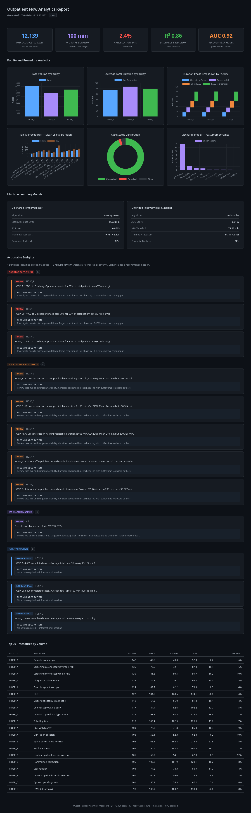
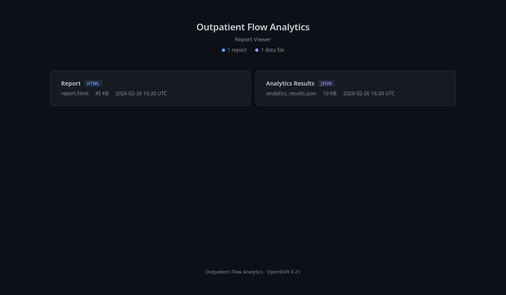

# 🏥 Synthetic Outpatient Flow Analytics Demo

> A reference implementation for a synthetic outpatient surgical flow analytics pipeline, designed to run on **OpenShift Container Platform 4.21** with GPU acceleration via NVIDIA H100.

[](https://www.python.org/)
[](https://docs.openshift.com/)
[](https://xgboost.readthedocs.io/)
[](https://rapids.ai/)
[](#)

---

## Architecture Overview

```mermaid
%%{init: {'theme': 'dark', 'themeVariables': { 'fontSize': '14px', 'fontFamily': 'Segoe UI, Helvetica, sans-serif', 'lineColor': '#8B949E' }}}%%

flowchart LR

  subgraph OCP["<b>OpenShift 4.21 · Azure Red Hat OpenShift</b>"]
    direction LR

    subgraph EDGE[" "]
      direction TB
      EDGE_TITLE["<b>📡 edge-collector</b>"]
      GEN("🔄 Data Generator\n<i>58 procedures · 3 facilities</i>")
      EPG[("🗄️ Edge Postgres\n<i>raw case events</i>")]
      GEN -- "synthetic\nevents" --> EPG
      EDGE_TITLE ~~~ GEN
    end

    subgraph CENTRAL[" "]
      direction TB
      CENTRAL_TITLE["<b>🧠 central-analytics</b>"]

      subgraph WORKERS[" "]
        direction TB
        ETL("⏱️ ETL CronJob\n<i>every 4 h · watermark-based</i>")
        CPG[("🗄️ Central Postgres\n<i>consolidated data</i>")]
        ETL -- "INSERT …\nON CONFLICT\nDO NOTHING" --> CPG
      end

      subgraph GPU[" "]
        direction TB
        ANA("📊 GPU Analytics\n<i>RAPIDS cuDF / cuML\nXGBoost gpu_hist</i>")
      end

      CENTRAL_TITLE ~~~ WORKERS
      WORKERS ~~~ GPU
      CPG -. "reads" .-> ANA
    end

    EPG == "Pattern B\ncentral pulls" ==> ETL

  end

  ANA -- "outputs" --> OUT("📈 Results\n<i>aggregates · model metrics\nactionable insights</i>")

  classDef cluster fill:#0D1117,stroke:#30363D,stroke-width:1px,color:#C9D1D9
  classDef edgeNs fill:#161B22,stroke:#1F6FEB,stroke-width:2px,color:#C9D1D9,rx:8
  classDef centralNs fill:#161B22,stroke:#8B5CF6,stroke-width:2px,color:#C9D1D9,rx:8
  classDef workerPool fill:#1C2128,stroke:#30363D,stroke-width:1px,stroke-dasharray:4,color:#8B949E
  classDef gpuPool fill:#0D2818,stroke:#3FB950,stroke-width:2px,stroke-dasharray:0,color:#C9D1D9,rx:8
  classDef app fill:#1F6FEB,stroke:#58A6FF,stroke-width:1px,color:#FFFFFF,rx:12
  classDef db fill:#21262D,stroke:#58A6FF,stroke-width:1px,color:#C9D1D9
  classDef gpu fill:#238636,stroke:#3FB950,stroke-width:1.5px,color:#FFFFFF,rx:12
  classDef result fill:#8B5CF6,stroke:#A78BFA,stroke-width:1px,color:#FFFFFF,rx:12
  classDef label fill:none,stroke:none,color:#8B949E

  class OCP cluster
  class EDGE edgeNs
  class CENTRAL centralNs
  class WORKERS workerPool
  class GPU gpuPool
  class GEN,ETL app
  class EPG,CPG db
  class ANA gpu
  class OUT result
  class EDGE_TITLE,CENTRAL_TITLE label

  linkStyle 0 stroke:#58A6FF,stroke-width:1.5px
  linkStyle 1 stroke:#58A6FF,stroke-width:1.5px
  linkStyle 2 stroke:#8B949E,stroke-width:1px,stroke-dasharray:4
  linkStyle 3 stroke:#F0883E,stroke-width:2.5px
  linkStyle 4 stroke:#A78BFA,stroke-width:1.5px
```



### Data Flow Summary

| # | Stage | Component | Schedule | Runs on |
|:-:|:------|:----------|:---------|:--------|
| 1 | **Generate** | Synthetic data generator | One-time Job | General workers |
| 2 | **Collect** | Edge PostgreSQL | Continuous | General workers |
| 3 | **Transfer** | ETL CronJob | `0 */4 * * *` | General workers |
| 4 | **Store** | Central PostgreSQL | Continuous | General workers |
| 5 | **Analyze** | GPU analytics pipeline | On-demand Job | NVIDIA H100 node |

## Components

### 1. Synthetic Data Generator (`src/generator/`)

Generates realistic outpatient surgical case events with:
- **58 procedure types** across 10 service lines (GI, Ophthalmology, ENT, Orthopedics, Pain, Urology, Gynecology, Dermatology, General Surgery, Cardiology)
- **3 facilities** with distinct procedure-mix biases and daily volume ranges
- **Log-normal duration distributions** for each phase (check-in→preop, preop→OR, OR→PACU, PACU→discharge)
- **Daily volume curves** (peak morning check-ins, no weekends)
- **Rare event injection**: cancellations (2%), inpatient conversions (1%), delays (3%)
- **Deterministic seeding** for reproducibility

```bash
python3 -m src.generator.generate \
  --start-date 2025-01-06 \
  --end-date 2025-03-31 \
  --seed 42 \
  --output output/cases.csv
```

### 2. ETL Batch Job (`src/etl/`)

Transfers data from edge PostgreSQL to central PostgreSQL every 4 hours:
- **Pattern B (Central pulls)**: CronJob connects to edge DB via ClusterIP Service
- **Watermark-based incremental transfer**: Only moves rows newer than last run
- **Idempotent inserts**: `INSERT ... ON CONFLICT DO NOTHING` prevents duplicates
- **Batched processing**: Configurable batch size for large datasets

```bash
python3 -m src.etl.batch_etl \
  --edge-host localhost --edge-port 5432 --edge-db edge_collector \
  --central-host localhost --central-port 5433 --central-db central_analytics
```

### 3. GPU Analytics (`src/analytics/`)

Runs on the H100 GPU node with automatic CPU fallback:
- **Aggregate metrics**: Mean/median/p90 durations, volumes, late-start rates per facility×procedure
- **Discharge time predictor**: XGBoost regressor (MAE ~12 min, R² ~0.87)
- **Extended recovery classifier**: XGBoost binary classifier (AUC ~0.92)
- **Operational insights**: High-variance procedures, late-start alerts, facility summaries, cancellation rates
- **HTML report**: Self-contained interactive report with Chart.js visualisations, KPI cards, and insight tables

```bash
# Run analytics (generates JSON + CSV + HTML report automatically)
python3 -m src.analytics.analytics \
  --input output/cases.csv \
  --output-dir output/analytics

# Or generate report standalone from existing results
python3 -m src.analytics.report \
  --results output/analytics/analytics_results.json \
  --aggregates output/analytics/aggregates.csv \
  --output output/analytics/report.html
```

#### Sample Report Output

<p align="center">
  
</p>

### 4. Report Viewer (`src/viewer/`)

Lightweight web UI for browsing and viewing analytics reports:
- **Zero dependencies** — uses Python's built-in `http.server`
- **Auto-discovers** all HTML reports and JSON data files in the output directory
- **Health endpoint** (`/healthz`) for Kubernetes readiness probes
- Deployed as a pod with an OpenShift Route for browser access

<p align="center">
  
</p>

```bash
# Run locally
python3 -m src.viewer.app --report-dir output/analytics --port 8080
# Open http://localhost:8080 in browser
```

## Data Model

### Core Tables

```sql
-- Star-schema fact table
outpatient_case_event
├── event_id (UUID PK)
├── facility_id → facility
├── procedure_type → procedure_catalog
├── scheduled_start_time, checkin_time, preop_start_time,
│   op_start_time, postop_start_time, discharge_time
├── anesthesia_type, asa_class, case_status
├── created_at, source_generator_id
└── dur_* (5 generated columns: durations in minutes)

-- Dimension tables
facility (facility_id PK, facility_name, timezone)
procedure_catalog (procedure_type PK, service_line, duration params×8)

-- ETL tracking (central DB only)
etl_watermark (source_id PK, last_created_at, last_run_at, rows_transferred)
```

### Procedure Catalog (58 types)

| Service Line   | Count | Examples                                         |
|---------------|-------|--------------------------------------------------|
| GI/Endoscopy  | 10    | Colonoscopy, EGD, ERCP, Capsule endoscopy        |
| Ophthalmology | 4     | Cataract extraction, YAG laser, Blepharoplasty   |
| ENT           | 6     | Tympanostomy, Tonsillectomy, FESS, Septoplasty   |
| Orthopedics   | 10    | Knee/shoulder arthroscopy, ACL, Carpal tunnel     |
| Pain          | 5     | Epidural injections, RF ablation, SCS trial       |
| Urology       | 5     | Cystoscopy, Vasectomy, ESWL, Prostate biopsy     |
| Gynecology    | 6     | D&C, Hysteroscopy, Endometrial ablation, LEEP     |
| Dermatology   | 5     | Mohs surgery, Skin excision, I&D, Lipoma          |
| General       | 5     | Lap chole, Hernia repair, Breast lumpectomy       |
| Cardiology    | 2     | Diagnostic cath, Cardioversion                    |

## OpenShift Deployment

### Prerequisites

- OpenShift Container Platform 4.21.x (verified on ARO 4.21.2)
- OpenShift Virtualization operator (for RHEL VM scenarios)
- NVIDIA GPU Operator + Node Feature Discovery (NFD) installed
- H100 GPU worker node with taint `nvidia.com/gpu=:NoSchedule`
- `oc` CLI authenticated to the cluster

### Container Images

Pre-built images are published to GitHub Container Registry and used by the OpenShift manifests:

| Image | Description | Containerfile |
|:------|:------------|:--------------|
| [`ghcr.io/samueltauil/hls-data-generator`](https://ghcr.io/samueltauil/hls-data-generator) | Synthetic data generator | `Containerfile.generator` |
| [`ghcr.io/samueltauil/hls-etl-job`](https://ghcr.io/samueltauil/hls-etl-job) | ETL batch job | `Containerfile.etl` |
| [`ghcr.io/samueltauil/hls-analytics`](https://ghcr.io/samueltauil/hls-analytics) | Analytics pipeline (CPU fallback) | `Containerfile.analytics-cpu` |
| [`ghcr.io/samueltauil/hls-analytics-gpu`](https://ghcr.io/samueltauil/hls-analytics-gpu) | **Analytics pipeline (RAPIDS + CUDA 12)** | `Containerfile.analytics` |
| [`ghcr.io/samueltauil/hls-report-viewer`](https://ghcr.io/samueltauil/hls-report-viewer) | Report viewer web UI | `Containerfile.viewer` |

> **GPU image**: `hls-analytics-gpu` is built from the NVIDIA RAPIDS 26.02 base image with cuDF,
> cuML, and XGBoost GPU support pre-installed (~8 GB). The OpenShift GPU job manifest
> (`06-gpu-analytics-job.yaml`) references this image. The CPU variant (`hls-analytics`) is a
> lightweight fallback — the Python code auto-detects GPU availability at runtime.

Images are automatically rebuilt on every push to `main` via GitHub Actions (`.github/workflows/build-images.yaml`).

### Manifest Overview

| File                          | Description                                          |
|-------------------------------|------------------------------------------------------|
| `00-namespaces.yaml`          | `edge-collector` and `central-analytics` namespaces  |
| `01-secrets.yaml`             | PostgreSQL credentials and cross-namespace access     |
| `02-edge-postgres.yaml`       | Edge PostgreSQL Deployment + PVC + Service            |
| `03-central-postgres.yaml`    | Central PostgreSQL Deployment + PVC + Service         |
| `04-data-generator-job.yaml`  | One-time Job to seed edge DB with synthetic data      |
| `05-etl-cronjob.yaml`         | CronJob running every 4 hours (`0 */4 * * *`)        |
| `06-gpu-analytics-job.yaml`   | GPU-pinned analytics Job with nvidia.com/gpu resource |
| `07-network-policies.yaml`    | Cross-namespace ETL access + internal-only central DB |
| `08-report-viewer.yaml`       | Report viewer Deployment + Service + Route            |

### Step-by-Step Deployment

#### Step 1 — Create namespaces

```bash
oc apply -f openshift/00-namespaces.yaml
```

#### Step 2 — Configure secrets

Edit `openshift/01-secrets.yaml` to set your database passwords (replace `changeme-*` values), then apply:

```bash
oc apply -f openshift/01-secrets.yaml
```

> **Note**: The pre-built images on `ghcr.io` are public — no pull secret is needed.
> If you rebuild to a private registry, create a pull secret:
> `oc create secret docker-registry registry-pull-secret --docker-server=REGISTRY --docker-username=USER --docker-password=TOKEN -n NAMESPACE`
> then `oc secrets link default registry-pull-secret --for=pull -n NAMESPACE`

#### Step 3 — Initialize databases

Create ConfigMaps from the SQL scripts so PostgreSQL containers run them at startup:

```bash
oc create configmap edge-db-init --from-file=db/ -n edge-collector
oc create configmap central-db-init --from-file=db/ -n central-analytics
```

Deploy edge and central PostgreSQL:

```bash
oc apply -f openshift/02-edge-postgres.yaml
oc apply -f openshift/03-central-postgres.yaml

# Wait for pods to be ready
oc wait --for=condition=available deployment/edge-postgres -n edge-collector --timeout=120s
oc wait --for=condition=available deployment/central-postgres -n central-analytics --timeout=120s
```

#### Step 4 — Apply network policies

```bash
oc apply -f openshift/07-network-policies.yaml
```

#### Step 5 — Seed edge DB with synthetic data

```bash
oc apply -f openshift/04-data-generator-job.yaml

# Monitor progress
oc logs -f job/data-generator -n edge-collector
```

#### Step 6 — Start the ETL CronJob

```bash
oc apply -f openshift/05-etl-cronjob.yaml

# Trigger an immediate first run (optional)
oc create job etl-manual-1 --from=cronjob/etl-edge-to-central -n central-analytics

# Monitor ETL
oc logs -f job/etl-manual-1 -n central-analytics
```

#### Step 7 — Run GPU analytics

```bash
oc apply -f openshift/06-gpu-analytics-job.yaml

# Monitor (waits for GPU node scheduling)
oc logs -f job/gpu-analytics -n central-analytics
```

#### Step 8 — Verify the deployment

```bash
# Check all pods
oc get pods -n edge-collector
oc get pods -n central-analytics

# Check CronJob schedule
oc get cronjob -n central-analytics

# Check analytics output
oc exec -n central-analytics deploy/central-postgres -- \
  psql -U central_user -d central_analytics -c "SELECT COUNT(*) FROM outpatient_case_event;"
```

### Scheduling Design

- **Data Generator**: One-time `Job` to seed edge DB; re-run with `oc delete job data-generator -n edge-collector` + `oc apply`
- **ETL CronJob**: `0 */4 * * *` with `concurrencyPolicy: Forbid` and `startingDeadlineSeconds: 300`
- **GPU Analytics**: On-demand `Job`; trigger manually after ETL, or convert to CronJob for recurring analysis
- **GPU Isolation**: `nodeSelector: nvidia.com/gpu.present=true` + toleration for `nvidia.com/gpu` taint ensures only analytics pods land on the GPU node

### Network Security

- Edge PostgreSQL accepts ingress only from ETL pods in `central-analytics` namespace
- Central PostgreSQL accepts ingress only from pods within its own namespace
- No external exposure of databases — all communication over cluster SDN

## Local Development

### Setup

```bash
# Install dependencies
python3 -m pip install numpy pandas scikit-learn xgboost pytest pytest-cov

# Run tests
python3 -m pytest tests/ -v

# Generate sample data
python3 -m src.generator.generate --start-date 2025-01-06 --end-date 2025-01-31 --output output/cases.csv

# Run analytics
python3 -m src.analytics.analytics --input output/cases.csv --output-dir output/analytics
```

### Container Builds (local testing)

```bash
podman build -f Containerfile.generator     -t hls-data-generator .
podman build -f Containerfile.etl           -t hls-etl-job .
podman build -f Containerfile.analytics-cpu -t hls-analytics .       # CPU variant
podman build -f Containerfile.analytics     -t hls-analytics-gpu .   # GPU variant (requires NVIDIA base image)
```

## Analytics Output

The analytics pipeline produces:

1. **`aggregates.csv`** — Per facility×procedure metrics (mean/median/p90 durations, volumes, late-start rates)
2. **`analytics_results.json`** — Full results including:
   - ML model performance metrics
   - Feature importance rankings
   - Operational insights with actionable messages

### Sample Insights

```
- HOSP_B: Mohs surgery shows high duration variance (σ=79.4 min). Staffing adjustment may help.
- HOSP_B: Endometrial ablation has 100% late start rate (>15 min past scheduled). Scheduling review recommended.
- HOSP_A: 385 completed cases, avg total time 77 min
- Overall cancellation rate: 1.8% (18/1007)
```

### ML Model Performance

| Model                      | Metric | Value  | Backend |
|---------------------------|--------|--------|---------|
| Discharge Time Predictor  | MAE    | ~12 min | XGBoost |
| Discharge Time Predictor  | R²     | ~0.87   | XGBoost |
| Extended Recovery Classifier | AUC  | ~0.86   | XGBoost |

GPU acceleration via RAPIDS cuDF/cuML is used automatically when available; otherwise CPU fallback is seamless.

## Project Structure

```
prototype-hls/
├── .gitignore                     # Git ignore rules (plan/, output/, caches)
├── README.md                      # This file
├── pyproject.toml                 # Python project config
├── requirements.txt               # Core dependencies
├── requirements-ml.txt            # ML dependencies
├── requirements-dev.txt           # Dev/test dependencies
├── Containerfile.generator        # Data generator container
├── Containerfile.etl              # ETL job container
├── Containerfile.analytics        # GPU analytics container (RAPIDS base)
├── Containerfile.analytics-cpu    # CPU analytics container (UBI9 base)
├── Containerfile.viewer           # Report viewer container
├── .github/
│   └── workflows/
│       └── build-images.yaml      # CI: build & push images to ghcr.io
├── db/
│   ├── schema.sql                 # PostgreSQL DDL (edge + central)
│   └── seed.sql                   # Facility + procedure catalog seed data
├── src/
│   ├── generator/
│   │   ├── catalog.py             # 58 procedure definitions + facility configs
│   │   └── generate.py            # Synthetic data generation engine
│   ├── etl/
│   │   └── batch_etl.py           # Watermark-based ETL (edge → central)
│   └── analytics/
│       ├── analytics.py           # GPU-accelerated analytics + ML pipeline
│       └── report.py             # Standalone HTML report generator
│   └── viewer/
│       └── app.py               # Report viewer web UI
├── openshift/
│   ├── 00-namespaces.yaml         # edge-collector + central-analytics
│   ├── 01-secrets.yaml            # Database credentials
│   ├── 02-edge-postgres.yaml      # Edge PostgreSQL deployment
│   ├── 03-central-postgres.yaml   # Central PostgreSQL deployment
│   ├── 04-data-generator-job.yaml # One-time data seeding job
│   ├── 05-etl-cronjob.yaml        # 4-hour ETL CronJob
│   ├── 06-gpu-analytics-job.yaml  # GPU-pinned analytics job
│   ├── 07-network-policies.yaml   # Cross-namespace network policies
│   └── 08-report-viewer.yaml     # Report viewer Deployment + Route
├── tests/
│   ├── test_catalog.py            # Procedure catalog validation
│   ├── test_generator.py          # Data generator unit tests
│   ├── test_etl.py                # ETL logic unit tests
│   └── test_analytics.py          # Analytics pipeline tests
└── output/                        # Generated data (gitignored)
```

## Design Decisions

| Decision | Rationale |
|----------|-----------|
| Pattern B ETL (central pulls) | Keeps central DB internal; VM addressable via ClusterIP Service |
| CronJob vs logical replication | 4-hour batch is easier to demo and visualize than continuous streaming |
| Star-schema with generated columns | Analytics-friendly; durations computed at DB level for query convenience |
| Log-normal duration distributions | Realistic for healthcare service times (right-skewed, positive) |
| XGBoost over deep learning | Tabular data with categorical features; GPU-accelerable; interpretable |
| RAPIDS with CPU fallback | Graceful degradation when GPU unavailable (dev/test environments) |
| Deterministic seeding | Reproducible demos; same seed = same data for consistent presentations |
| 58 procedures across 10 lines | Broad enough for meaningful analytics; realistic ASC scope |

